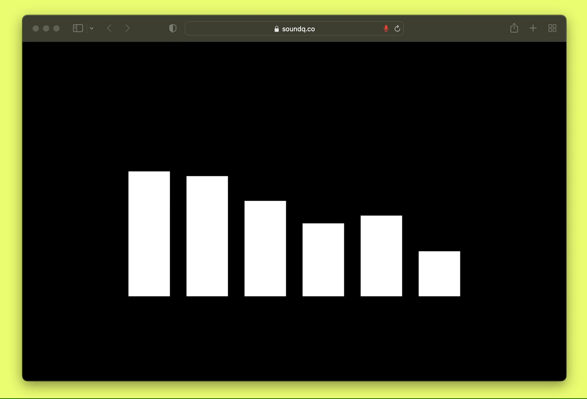

<div align="center">
  <p>
    <a href="https://soundq.co">
      
    </a>
  </p>
</div>

**[Soundq](https://soundq.co)** is an audio display equalizer built in Javascript inspired by the HiFi systems of the ’80s and ’90s that works by listening to your device’s microphone using the [Web Audio API](https://developer.mozilla.org/en-US/docs/Web/API/Web_Audio_API).

I usually run it on an iPad mini alongside Sonos, and I love the minimalist feel and hypnotic-like effect of listening and visualizing music simultaneously.



## Developing
```
npm install
npm run dev
```

The code is pretty straightforward and easy to [customize things like](src/App.svelte):
- Bars
- Thickness 
- Gap
- Color